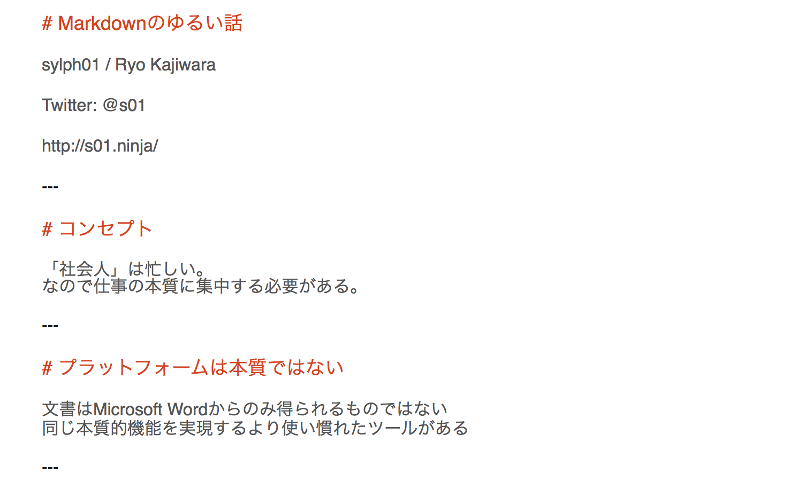
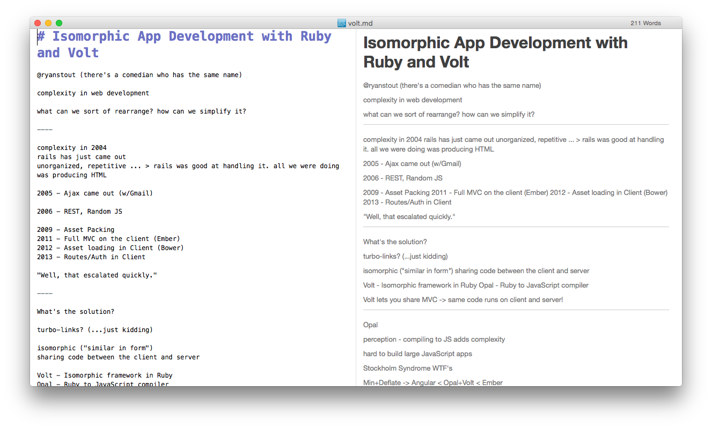
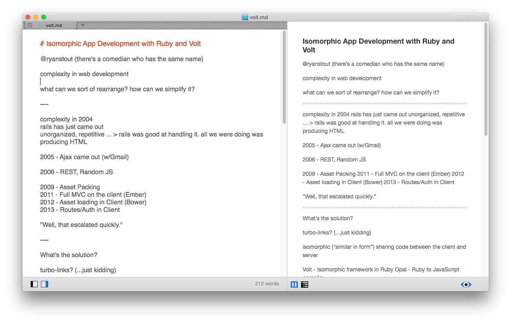
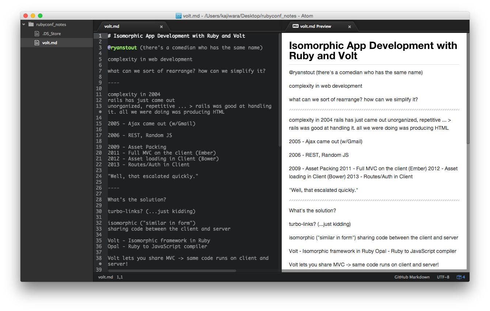
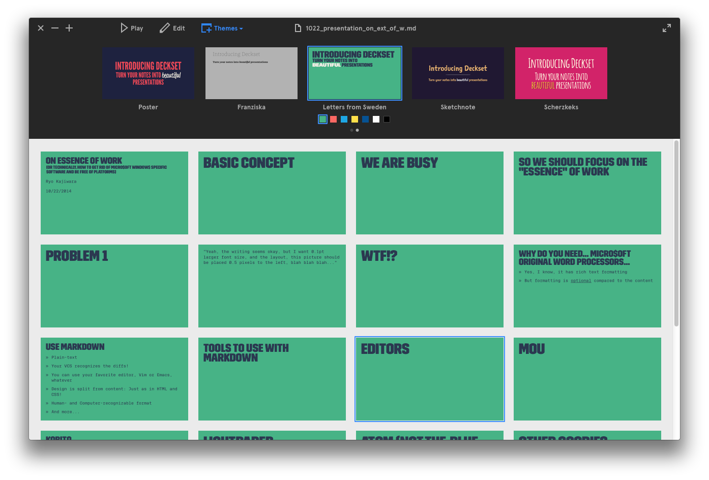
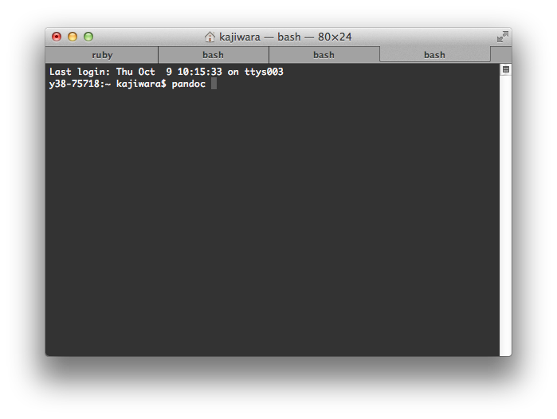
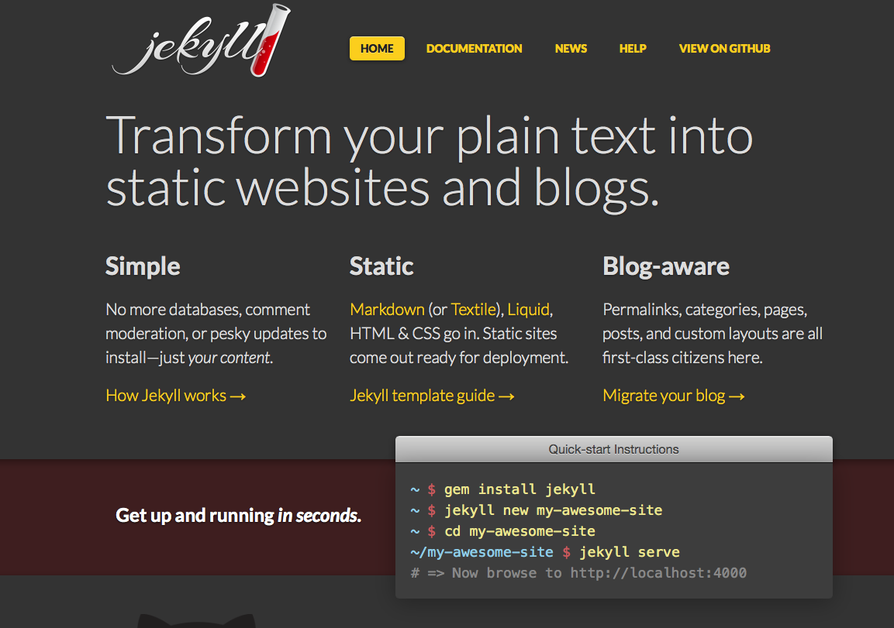
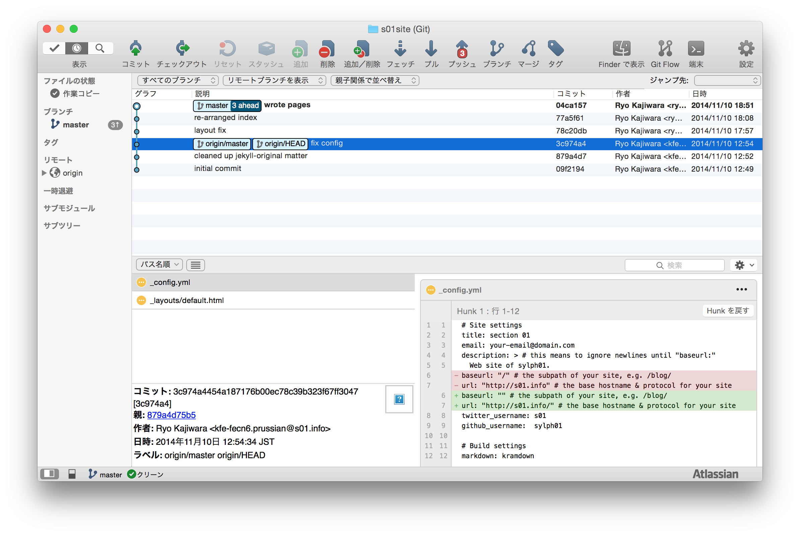

# Markdownのゆるい話

sylph01 / Ryo Kajiwara

Twitter: @s01

http://s01.ninja/

2014.11.23

---

#[fit] 資料はここ(予定)
#[fit] http://s01.ninja/md_yurui.pdf

---

# 中の人について

sylph01 / 梶原 龍
Twitter: @s01

オーケストラでファゴット吹いてます

（技術的にはただの人）

---

---

# コンセプト

「社会人」は忙しい。
なので仕事の本質に集中する必要がある。

---

# プラットフォームは本質ではない

文書はMicrosoft Wordからのみ得られるものではない
同じ本質的機能を実現するより使い慣れたツールがある

---

# 作業環境も本質ではない

それhogehogeでしかできないって本当ですか

---

#[fit] Markdown
#[fit] を使おう

---

# What is Markdown

John Gruber氏によって考案された構造化テキストフォーマット
可読性を保ちながら機械処理もしやすい

---

# こんな感じ

---

---

# Why Markdown

プレーンテキスト
Gitに入れてdiffが取れる
エディタの縛りを受けない
機械処理しやすいフォーマット
対応ツールが多い
デザインとコンテンツの分離

---

#[fit] 対応ツール
#[fit] 紹介

---

#[fit] Mou

軽量なMac向けMarkdownエディタ
iPad版もある

---

#[fit] LightPaper

軽量なMac向けMarkdownエディタ
GitHub Flavored Markdown寄りのレンダリング

---

#[fit] Atom

モダンテキストエディタの最先鋒ももちろん対応
最も正しいGitHub Flavored Markdownのレンダリング

---

#[fit] Deckset

今プレゼンしてるやつ
日本語対応がまだちょっと微妙
数式サポートもある (例: $$e^{i\pi} = -1$$)
$30, 数式サポートで+$10

---

#[fit] Pandoc

HTML, PDF, LaTeX, EPUB, docx(!)など、Markdownなどから大抵のドキュメントフォーマットを得られるコマンドラインツール

---

#[fit] Jekyll

GitHub Pagesのエンジン
Markdownから静的サイトを得る

---

---

# 応用例: Webサイトをまるっとバージョン管理

- Jekyllのサイト作成
- Gitに入れる
- サーバー側でpost-update hookでJekyllを走らせてサイト更新

---

# 応用例2: ドキュメントレビュー、ドキュメントCI

- ドキュメントをGitでバージョン管理
- GitHub上で内容をレビュー
- コミットに対して最終結果をPandoc等で自動生成
- 最後にデザイン等を調整

---

# 応用例3: どこでもスライド作成

- 同様にGitでバージョン管理
- レポジトリの内容をもとにDeckset / Pandocでスライド生成(前者は未検証)
- サーバーに自動で更新
- テキストエディタだけでスライドが作れる！

---

#[fit] 結果。

---

#[fit] テキストエディタと
#[fit] Gitだけで

---

#[fit] どんな環境でも
#[fit] 仕事ができる

---

---

# 細かい話: フォーマットの違い

方言がたくさんある
例：
ヘッダの前後に空行が必要か必要でないか、
Ordered Listの記法(1. 2. vs +)、
ヘッダの記法(=== vs #)
改行の処理(そのまま vs 末尾に空白x2)

---

# 細かい話: フォーマットの違い

何を重視するかの差
GitHub Flavored MarkdownはGitHubに入るような文章を書きやすくしている（コードの文法指定など）
Day OneのMarkdownは書きやすさを重視
ヘッダの下線や数字での箇条書きは読みやすさを重視

---

# 個人的な考え

改行のためにTrailing Whitespace入れたくない
ヘッダの前後の空行とかも要らない
Ordered Listも要素数増えるときに数字増やすのが厄介

---

# 対策

CommonMark/GitHub Flavored Markdown をベースに書きやすいようサブセットを選択したパーサ/コンバータを作成（予定）

---

---

#[fit] まとめ

---

#[fit] Markdownで
#[fit] 楽しい
#[fit]ドキュメントライフ

---

# ありがとうございました